# SAMCell: Technical Deep Dive

A comprehensive technical explanation of SAMCell's architecture, design decisions, and implementation.

## 🎯 Problem Statement

**Task**: Instance segmentation of biological cells in microscopy images  
**Challenge**: Cells have weak boundaries, are densely packed, and vary across imaging modalities  
**Goal**: Zero-shot generalization to unseen cell types and microscopes

## 🏗️ Architecture Overview

```mermaid
graph TB
    A[Input Image<br/>Any Size] --> B[CLAHE Preprocessing]
    B --> C[Sliding Window<br/>256×256 patches, 32px overlap]
    C --> D[Upsample to 1024×1024<br/>Bilinear]
    D --> E[SAM Image Encoder<br/>ViT-Base, FROZEN PROMPT]
    E --> F[SAM Mask Decoder<br/>Fine-tuned]
    F --> G[Distance Map Prediction<br/>256×256, sigmoid activation]
    G --> H[Combine Patches<br/>Cosine blending]
    H --> I[Watershed Post-Processing]
    I --> J[Cell Instance Masks]
    
    style E fill:#90EE90
    style F fill:#FFB6C1
    style G fill:#87CEEB
```



## 🔑 Key Technical Decisions

### Decision 1: Distance Map Regression (Not Classification)

**Standard Approach** (U-Net, MedSAM, SAMed):
- Predict 2 or 3 classes: {cell, background} or {cell, border, background}
- Problem: Merged cells when boundaries are weak
- Weighted loss functions help but don't solve the problem

**Our Approach**:
- Predict continuous-valued distance map: \(d(p) = \text{Euclidean distance from pixel } p \text{ to nearest cell boundary}\)
- Normalized to [0, 1] by dividing by max distance within each cell
- Advantages:
  - Soft edges preserved in continuous values
  - Watershed naturally separates touching cells
  - No arbitrary category boundaries

**Distance Map Formula**:
```
For each cell C with pixels P_C:
  d(p) = min ||p - b|| for all boundary pixels b in C
  d_norm(p) = d(p) / max(d(p) for p in P_C)
```

### Decision 2: Sliding Window with Specific Patch Size (256×256)

**Why sliding window?**
1. **SAM's architecture**: Takes 1024×1024 input → produces 256×256 output
2. **Resolution preservation**: Microscopy images are 2048×2048 or larger; direct resize loses detail
3. **Training alignment**: SAM was pretrained on 1024×1024 images
4. **Pixel correspondence**: 256×256 patches map directly to 256×256 outputs (no interpolation)

**Why 256×256 specifically?** (Ablation study in paper)
- Tested: 128×128, 256×256, 512×512
- 256×256 optimal because SAM outputs 256×256 natively
- Avoids interpolation artifacts

**Overlap strategy**:
- 32 pixels overlap on each side
- Cosine falloff blending to avoid edge artifacts
- Formula: \(w(x) = 0.5 \times (1 + \cos(\pi \times x / 32))\)

### Decision 3: Freeze Prompt Encoder, Fine-tune Image Encoder + Mask Decoder

**SAM Components**:
1. Image Encoder (ViT-Base, ~90M params)
2. Prompt Encoder (~small, encodes points/boxes)
3. Mask Decoder (~lightweight, produces masks)

**Our Fine-tuning Strategy**:
```
Image Encoder: ✅ FINE-TUNE (all 90M params)
Prompt Encoder: ❌ FREEZE
Mask Decoder: ✅ FINE-TUNE (modify output head)
```

**Why fine-tune image encoder?**
- MedSAM did this and showed strong results
- We don't use prompts, so encoder must learn everything from image
- Tried LoRA (parameter-efficient) but performance dropped significantly

**Why freeze prompt encoder?**
- Always use default prompt embedding
- Prompt encoder learns to ignore itself
- Saves ~1M parameters from training

**Mask Decoder modifications**:
- Original: Outputs 3 binary masks (256×256) + confidence scores
- Ours: Output single continuous distance map (256×256)
- Changed final layer: Conv2d(..., out_channels=1) + Sigmoid

### Decision 4: Watershed Post-Processing

**Why watershed?**
1. **Natural fit for distance maps**: Treats distance map as topography
2. **Separates touching cells**: Flooding from multiple peaks creates boundaries where they meet
3. **Deterministic**: Same input always gives same output
4. **Efficient**: O(n log n) complexity, well-optimized in OpenCV

**Watershed Algorithm**:
```
1. Threshold distance map → Binary mask (cell/background)
2. Threshold higher → Cell centers (one component per cell)
3. Apply watershed:
   - Treat distance map as elevation
   - Flood from cell centers (peaks)
   - Boundaries form where floods meet (valleys)
4. Result: Individual cell masks
```

**Threshold selection** (from ablation study):
- Cell peak threshold: 0.47 (finds cell centers)
- Cell fill threshold: 0.09 (defines cell extent)
- Grid search over [0.05, 0.9] × [0.05, 0.9]
- Optimal values balance precision and recall

### Decision 5: SAM-Base vs SAM-Large

**Ablation results** (S1 Appendix):
- SAM-Large: Slightly better (3-5% improvement in OP_CSB)
- SAM-Base: Faster inference, lower memory

**Choice**: SAM-Base for main experiments
- Reason: Computational efficiency for user-facing tool
- Inference time: ~5s/image on RTX 4090 (vs ~10s for SAM-Large)
- VRAM: 8GB (vs 16GB for SAM-Large)

### Decision 6: Training Dataset Combination

**Datasets available**:
1. **LIVECell**: 5,000 images, 8 cell types, phase contrast, single microscope
2. **Cellpose Cytoplasm**: 600 images, diverse internet scrape, multiple modalities

**Ablation results**:
```
SAMCell-LiveCell only:  OP_CSB = 0.466 (PBL-HEK), 0.720 (PBL-N2a)
SAMCell-Cyto only:      OP_CSB = 0.454 (PBL-HEK), 0.807 (PBL-N2a)
SAMCell-Generalist:     OP_CSB = 0.598 (PBL-HEK), 0.824 (PBL-N2a)  ✓ BEST
```

**Why combination works**:
1. Increased sample size (5,600 images total)
2. Greater diversity (phase contrast + fluorescence, 8+ cell types)
3. Complementary strengths (LIVECell's density + Cyto's diversity)

## 📊 Training Protocol

### Hyperparameters
```python
Optimizer: AdamW
Learning Rate: 1e-4 (initial)
LR Schedule: Linear warmup (250 iters) → Linear decay to 0
Weight Decay: 0.1
Beta1, Beta2: 0.9, 0.999
Batch Size: 8
Epochs: 35-100 (early stopping, patience=7, min_delta=0.0001)
Loss: MSE (Mean Squared Error) on distance maps
```

### Data Augmentation
```python
- Horizontal flip: p=0.5
- Rotation: uniform(-180°, 180°)
- Scale: uniform(0.8, 1.2)
- Brightness: uniform(0.95, 1.05)
- Inversion: p=0.5  # Key for generalization!
```

**Why inversion?**
- Phase contrast: dark cells on light background
- Dark field: light cells on dark background
- Inversion creates invariance to microscopy type

### Training Time
- **SAMCell-Generalist**: 35 epochs, ~5 hours on A100 80GB
- Early stopping triggered at epoch 35 (validation loss plateaued)

## 📈 Performance Results

### Test-Set Performance

| Model | Dataset | SEG | DET | OP_CSB |
|-------|---------|-----|-----|--------|
| **SAMCell** | LIVECell | **0.652** | **0.893** | **0.772** |
| Cellpose | LIVECell | 0.589 | 0.779 | 0.684 |
| Stardist | LIVECell | 0.572 | 0.771 | 0.671 |
| CALT-US | LIVECell | 0.560 | 0.790 | 0.675 |

### Zero-Shot Cross-Dataset Performance

| Model | Dataset | SEG | DET | OP_CSB |
|-------|---------|-----|-----|--------|
| **SAMCell-Generalist** | PBL-HEK | **0.425** | **0.772** | **0.598** |
| Cellpose-Cyto | PBL-HEK | 0.253 | 0.388 | 0.320 |
| Stardist-Cyto | PBL-HEK | 0.142 | 0.236 | 0.189 |
| **SAMCell-Generalist** | PBL-N2a | **0.707** | **0.941** | **0.824** |
| Cellpose-Cyto | PBL-N2a | 0.642 | 0.885 | 0.764 |

Key observation: **~87% improvement over Stardist on PBL-HEK**

### Pretraining Impact (Critical Finding)

| Initialization | LIVECell OP_CSB | PBL-HEK OP_CSB |
|----------------|-----------------|----------------|
| **Pretrained SAM** | **0.772** | **0.598** |
| Random weights | 0.309 | 0.418 |
| **Improvement** | **+150%** | **+43%** |

**Conclusion**: Pretraining is essential for performance.

## 🔬 Evaluation Metrics

### SEG (Segmentation Accuracy)
```
SEG = Jaccard Index = |R ∩ S| / |R ∪ S|
```
Where R = reference (ground truth), S = segmentation (prediction)

### DET (Detection Accuracy)
```
DET = 1 - min(AOGM-D, AOGM-D₀) / AOGM-D₀
```
Based on graph matching: # operations to convert prediction graph → ground truth graph

### OP_CSB (Overall Performance)
```
OP_CSB = 0.5 × (SEG + DET)
```

All metrics in [0, 1], higher is better.

## 🎨 Implementation Details

### Distance Map Creation (Preprocessing)
```python
from scipy.ndimage import distance_transform_edt

def create_distance_map(mask):
    """
    mask: (H, W) with unique label per cell
    Returns: (H, W) normalized distance map
    """
    distance_map = np.zeros_like(mask, dtype=float)
    
    for label in np.unique(mask)[1:]:  # Skip background (0)
        cell_mask = (mask == label)
        # Distance transform: distance to nearest 0 pixel
        dist = distance_transform_edt(cell_mask)
        # Normalize by max distance within this cell
        if dist.max() > 0:
            dist = dist / dist.max()
        distance_map[cell_mask] = dist[cell_mask]
    
    return distance_map
```

### Sliding Window Inference
```python
def sliding_window_inference(image, model, crop_size=256, overlap=32):
    H, W = image.shape
    stride = crop_size - overlap
    
    # Create output canvas
    dist_map = np.zeros((H, W))
    weight_map = np.zeros((H, W))
    
    # Cosine blending weights
    blend_mask = create_cosine_blend(crop_size, overlap)
    
    for y in range(0, H - crop_size + 1, stride):
        for x in range(0, W - crop_size + 1, stride):
            # Extract patch
            patch = image[y:y+crop_size, x:x+crop_size]
            
            # Upsample to 1024×1024
            patch_1024 = resize(patch, (1024, 1024))
            
            # Predict
            pred_1024 = model(patch_1024)  # → 256×256
            
            # Add to canvas with blending
            dist_map[y:y+crop_size, x:x+crop_size] += pred_1024 * blend_mask
            weight_map[y:y+crop_size, x:x+crop_size] += blend_mask
    
    # Normalize by blend weights
    return dist_map / np.maximum(weight_map, 1e-8)
```

### Watershed Post-Processing
```python
import cv2
from skimage.morphology import watershed

def distance_map_to_masks(dist_map, peak_thresh=0.47, fill_thresh=0.09):
    # Binary mask (cell vs background)
    binary_mask = (dist_map > fill_thresh).astype(np.uint8)
    
    # Cell centers (one per cell)
    cell_centers = (dist_map > peak_thresh).astype(np.uint8)
    
    # Label connected components in centers
    n_centers, centers_labeled = cv2.connectedComponents(cell_centers)
    
    # Watershed: use distance map as elevation
    # Flood from centers, boundaries where floods meet
    labels = watershed(-dist_map, centers_labeled, mask=binary_mask)
    
    return labels
```

## 🧪 Ablation Studies Summary

### Study 1: Training Dataset Combinations

**Finding**: Generalist (Cyto + LIVECell) >> Individual datasets

**Hypothesis**: Complementary diversity
- LIVECell: Homogeneous (8 cell types, 1 microscope) but large scale
- Cytoplasm: Heterogeneous (internet scrape, multiple modalities) but small
- Combined: Best of both worlds

### Study 2: Model Variant (SAM-Base vs SAM-Large)

**Results**:
```
PBL-HEK:  SAM-L OP_CSB = 0.637  vs  SAM-B OP_CSB = 0.598  (+6.5%)
PBL-N2a:  SAM-L OP_CSB = 0.842  vs  SAM-B OP_CSB = 0.824  (+2.2%)
```

**Decision**: Use SAM-Base
- Modest improvement (2-6%) vs 2x inference time
- User-facing tool needs speed
- SAM-Large available for accuracy-critical applications

### Study 3: Patch Size

**Results**:
```
PBL-HEK:  128×128 = 0.487  |  256×256 = 0.598 ✓  |  512×512 = 0.540
PBL-N2a:  128×128 = 0.820  |  256×256 = 0.824 ✓  |  512×512 = 0.765
```

**Conclusion**: 256×256 optimal
- Matches SAM's native 256×256 output dimension
- No interpolation artifacts
- Best performance empirically

### Study 4: Pretraining

**Critical finding**: Pretraining is ESSENTIAL

**Results** (comparing pretrained SAM vs random init):
```
                    Pretrained    Random Init   Difference
LIVECell OP_CSB:      0.772        0.309        +150%
Cyto OP_CSB:          0.739        0.282        +162%
PBL-HEK OP_CSB:       0.598        0.418        +43%
PBL-N2a OP_CSB:       0.824        0.727        +13%
```

**Insight**: SAM's 11M image pretraining transfers to microscopy
- Even though pretraining was on "everyday" images (people, food, etc.)
- Learned general concept of boundaries and objects
- Dramatically improves convergence and final performance

### Study 5: Post-Processing Thresholds

**Grid search**: peak ∈ [0.05, 0.9], fill ∈ [0.05, 0.9]

**Results**:
- PBL-HEK optimal: peak=0.50, fill=0.08 → OP_CSB=0.605
- PBL-N2a optimal: peak=0.45, fill=0.10 → OP_CSB=0.831
- **Global optimal**: peak=0.47, fill=0.09 → Average OP_CSB=0.715

**Interpretation**:
- peak=0.47: Relatively high threshold ensures only cell center regions selected
- fill=0.09: Low threshold captures full cell extent including weak boundaries

## 🎯 Why SAMCell Works

### 1. Strong Foundation: SAM's Pretraining
- 11M images, 1B masks
- Learned general boundary detection
- Transfers to microscopy despite domain shift

### 2. ViT Architecture Advantages
- Self-attention captures long-range dependencies
- Better than CNNs (U-Net, Stardist) for global context
- Can see entire patch simultaneously (not just local receptive fields)

### 3. Distance Map Formulation
- Continuous values preserve soft boundary information
- Easier optimization than hard classification
- Natural input for watershed

### 4. Robust Post-Processing
- Watershed separates touching cells reliably
- Two-threshold strategy (centers + fill) provides control
- Well-tested classical algorithm

### 5. Training Strategy
- Dataset combination increases diversity
- Data augmentation (especially inversion) improves generalization
- Early stopping prevents overfitting

## 🚧 Limitations (Acknowledged in Paper)

### 1. Inference Speed
- **SAMCell**: ~5s/image on RTX 4090, ~140s on CPU
- **Baselines**: <1s/image on RTX 4090, ~5s on CPU
- **Reason**: ViT-Base is large (~90M params) vs U-Net (~1-5M params)
- **Mitigation**: Recommend GPU, provide Google Colab notebook

### 2. Peanut-Shaped Cells
- Cells dividing (constricted in middle) may be split into 2
- Distance map has 2 local maxima
- Watershed separates them
- **Impact**: Minor (dividing cells are minority in culture)

### 3. Resolution Trade-offs
- 256×256 patches: Good for most cells (10-50 pixels diameter)
- Very large cells (>200 pixels): May need larger patches
- Very small cells (<5 pixels): May need smaller patches

## 🎓 Novel Contributions

### 1. Distance Map Regression for SAM
- **First** to apply distance map regression to SAM architecture
- Previous SAM adaptations (MedSAM, SAMed, CellSAM) used classification
- Overcomes weak boundary problem in cell segmentation

### 2. Prompt-Free Instance Segmentation
- MedSAM, CellSAM require prompts (bounding boxes)
- Impractical for 100s of cells per image
- We freeze prompt encoder → automatic segmentation

### 3. New Evaluation Datasets
- **PBL-HEK**: 5 images, ~300 cells each, different microscope
- **PBL-N2a**: 5 images, ~300 cells each, different microscope
- Realistic zero-shot evaluation
- Publicly released

### 4. Comprehensive Ablation Studies
- Dataset combinations
- Model variants
- Patch sizes
- Pretraining impact
- Threshold selection
- Provides guidance for practitioners

## 📐 Mathematical Formulation

### Training Objective
```
L = (1/N) Σᵢ ||D_pred(Iᵢ) - D_true(Iᵢ)||²

Where:
  Iᵢ = input image patch (256×256)
  D_true = ground truth distance map (computed from mask)
  D_pred = predicted distance map from model
  N = number of patches in batch
```

### Distance Map Normalization
```
For cell C:
  d_raw(p) = min_{b∈∂C} ||p - b||₂
  d_norm(p) = d_raw(p) / max_{p'∈C} d_raw(p')

Where:
  ∂C = boundary pixels of cell C
  ||·||₂ = Euclidean distance
```

### Watershed Boundary Condition
```
Boundary between cells A and B occurs at:
  argmin_p {d_A(p) - d_B(p)} where p ∈ watershed basin boundary
  
Simplified: Where floods from centers A and B meet
```

## 🔧 Engineering Challenges & Solutions

### Challenge 1: Memory for Sliding Window
**Problem**: Large images (2048×2048) with overlap create many patches  
**Solution**: Process patches in batches, accumulate in output canvas with blend weights

### Challenge 2: Variable Image Sizes
**Problem**: Cytoplasm has different sizes (300×400, 512×512, etc.)  
**Solution**: Resize all to 512×512 with aspect-preserving padding

### Challenge 3: Multiclass Output from SAM
**Problem**: SAM outputs 3 masks + scores, we need 1 distance map  
**Solution**: Modify final Conv2d layer: out_channels=3 → out_channels=1, add Sigmoid

### Challenge 4: Training on Mixed Datasets
**Problem**: LIVECell (704×520) vs Cytoplasm (512×512) different sizes  
**Solution**: Random crop 256×256 from both, effectively same augmentation pipeline

## 💡 Key Insights for Interviews

### Why This Works Better Than U-Net
1. **Pretraining**: SAM pretrained on 11M images vs U-Net from scratch
2. **Architecture**: ViT self-attention vs CNN local receptive fields
3. **Capacity**: 90M params vs 1-5M params (less prone to underfitting)

### Why Distance Maps > Classification
1. **Continuous representation**: Preserves soft boundary information
2. **Natural for watershed**: Distance = elevation in topography
3. **Avoids hard decisions**: Model doesn't have to make binary cell/border choice

### Why Generalist > Specialist
1. **Diversity**: Exposure to more cell morphologies and imaging conditions
2. **Sample size**: 5,600 images vs 600 or 5,000 alone
3. **Complementary**: LIVECell's scale + Cytoplasm's diversity

### Critical Design Choice
**Most important decision**: Using distance map regression instead of classification
- Enabled by: Watershed post-processing
- Result: Solved the merged cells problem
- Novel: First application to SAM architecture

## 📚 Comparison to Related Work

| Method | Backbone | Approach | Prompt | Key Innovation |
|--------|----------|----------|--------|----------------|
| **SAMCell** | SAM ViT-B | Distance map regression | None | Distance map + watershed for SAM |
| MedSAM | SAM ViT-B | Binary segmentation | Bbox | 1M medical images, keep prompting |
| SAMed | SAM ViT-B | Multi-class segmentation | None | LoRA fine-tuning, semantic seg |
| CellSAM | SAM ViT-B | Binary segmentation | Bbox | Object detection → SAM prompting |
| CellViT | SAM encoder | U-Net decoder | None | Replace decoder with U-Net |
| Cellpose | U-Net | Vector field | None | Gradient flow to centers |
| Stardist | U-Net | Star-convex | None | Radial distance to boundary |

**SAMCell's unique position**: Only one using distance map + watershed with SAM.

## 🏆 Publication Impact

- **Venue**: Submitted to PLoS (pending review based on tex files)
- **Open Source**: Code + pretrained weights + datasets on GitHub
- **GUI**: User-friendly interface for biologists (no ML expertise needed)
- **Citations**: Foundation for DINOCell and future cell segmentation work

## 📝 Interview Talking Points

1. **Problem**: "Cell segmentation is hard because boundaries are weak and cells are packed"
2. **Insight**: "Classification struggles with this. Regression to distance maps preserves soft boundaries"
3. **Innovation**: "We're the first to apply distance map regression to SAM architecture"
4. **Results**: "87% improvement over Stardist on challenging zero-shot dataset"
5. **Impact**: "Enables automated cell culture monitoring without ML expertise"

